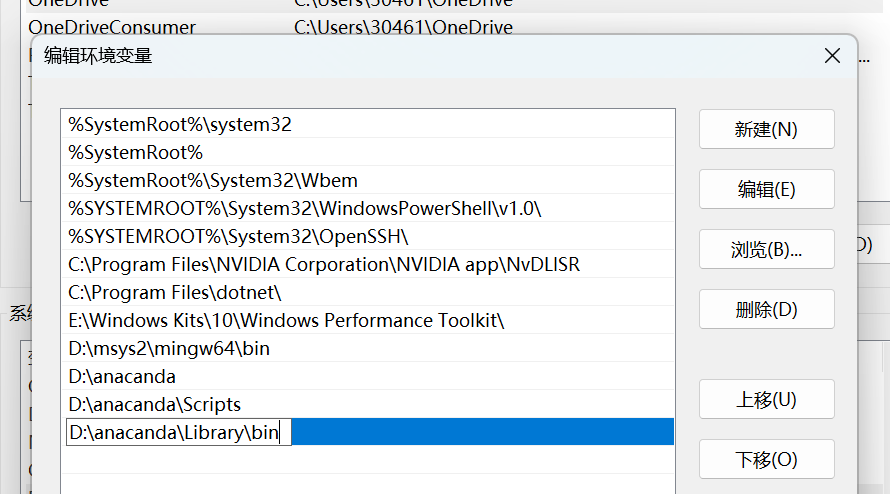
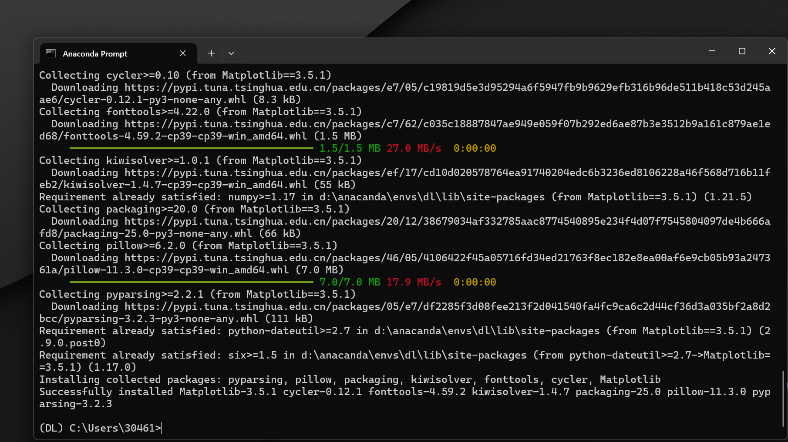
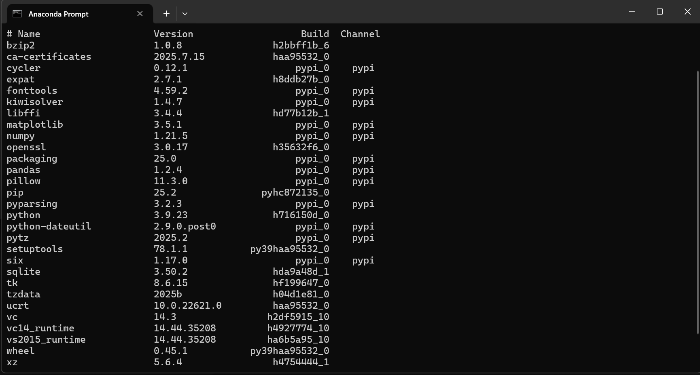
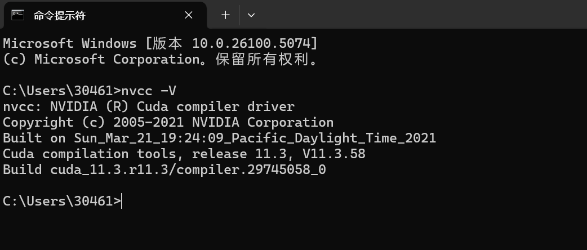
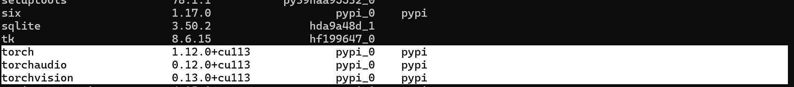
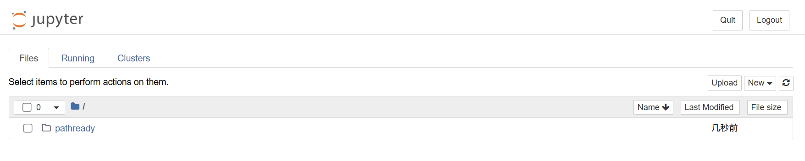
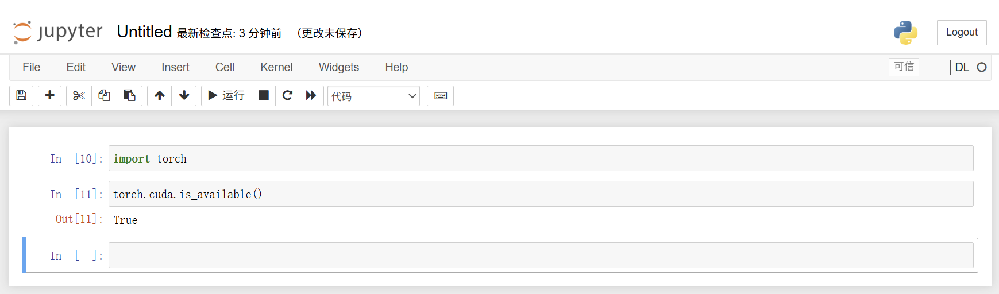
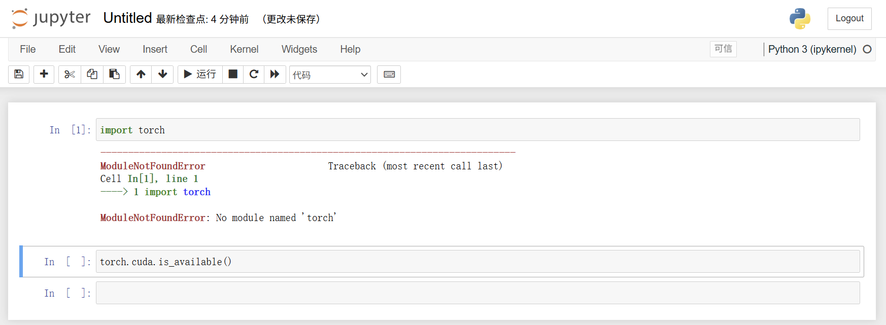
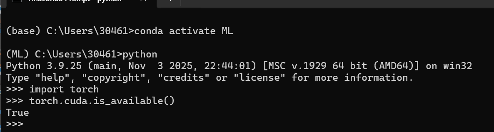

# 前置工具安装
## (1)关于 ***anaconda*** 
### 1. 安装anaconda
1. 注意因为服务器在国外——两种方式
    1. 选择使用[镜像源](https://mirrors.bfsu.edu.cn/anacanda/archive/)下载 
    2. 科学上网(因为我选择了这种方法，我因此学会了科学上网，并白嫖到了机场)
2. 在安装过程中我调整了安装路径为D:\anaconda
3. 调整环境变量
    
4. 安装pytorch(GPU)
    1. 创建虚拟环境：在Prompt中进入Anacanda环境，他需要应用到一些基本命令[^1]
    2. 安装配置虚拟环境，并下载库
    
    
    3. 安装CUDA
    
    4. 安装PyTorch（==此处需要翻墙，不容易死机，血泪的教训...==）(当然绕一下路也可以，这是后来了解到的方法二，但有白嫖且简单的途径，何乐而不为呢)
    
5. Jupyters使用：修正路径
    
6. 虚拟环境链接jupyter:
    1. prompt操作：
    pip install ipykernel -i https://pypi.tuna.tsinghua.edu.cn/simple
    python -m ipykernel install --user --name=xxx
    jupyter kernelspec remove xxx
    
    
    上图证明，我们的jupyter已经连接好DL的虚拟环境，并且只有在DL环境中安装了pytorch,在大环境中没有;
7. 最终展示(GPU加速):
    
至此，anaconda的作用在安装中逐一体现，深化了对环境的理解。花了我好长时间来做这些事情哈哈，不过接下来可以学技术和理论了

==我的感悟==：各个路径的修改方式不尽相同，一定程度上延缓了学习的进度；不过也确实在动手安装的过程中，体会到在命令提示符中操作的方法和一些基本的环境配置和库联网下载的语法
注意：因为前面已经详细叙述过虚拟环境的重要性和作用，下面简单写下我对anacanda的看法(ML版)
### 2. Anaconda本身
因为前置知识已经涉及虚拟环境的知识，此处不赘述
***Anaconda*** 是一个一站式的数据科学平台和包管理工具
包含两部分：
1. 一个庞大的预编译科学计算库集合
2. 强大的环境和包管理工具（类似于Python自带的pip 和 venv）
    ==问题==：既然存在venv我为什么还需要anaconda?
    ==anwser==:venv只能建立一个python的隔离环境，而conda可以建立对标base的大环境，也就是说，它不仅可以管理Python包，还可以：
    1. 管理不同版本的Python解释器（如同时安装Python 3.8和Python 3.11的环境）
    2. 管理非Python的依赖（比如R语言、C库等）
    3. 环境隔离得更彻底、更干净
3. 在机器学习中的必要性：
        极其重要：以避免在安装配置环境上浪费大量时间，遇到问题的概率最小，能让你快速开始学习
[^1]:命令：
    1. 清屏：cls
    2. base环境的命令：
        1. 列出所有环境:conda env list
        2. 创建名字为“xxx”的虚拟环境，并指定python的版本：canda create-n xxx python=3.9
        3. 创建名字为“xxx”的虚拟环境，并指定python的版本并指定安装路径create--prefix=安装路径\xxx python=3.9          
        4. 删除：conda remove -n xxx --all
        5. conda activate
    3. 虚拟环境的命令：
        1. 列出所有库：canda activate xxx
        2. 安装几个库：
            1. pip install numpy==1.21.5 -i https://pypi.tuna.tsinghua.edu.cn/simple
            2. pip install Pandas==1.2.4 -i https://pypi.tuna.tsinghua.edu.cn/simple
            3. pip install Matplotlib==3.5.1 -i https://pypi.tuna.tsinghua.edu.cn/simple
        3. 查看库的版本：pip show xxx
        4. 退出虚拟环境：conda deactivate

    
***
## (2)关于我们需要的 ***python*** 
### 1. 工具组成
1. python解释器：python编程（最先下载）
2. 代码编译器：看懂我的代码
3. Anaconda集成平台：第三方库的重要来源
### 2. python、pytorch、pycharm
这三者的关系：
• Python = 英语
• PyTorch = 一套关于“人工智能”的专业词汇和语法书
• PyCharm = 一个非常强大的英语写作软件（比如高级版的Word）
关于***pytorch***:
>Torch（专业词汇和语法书 - 框架）
    • 是什么？ 它是一个基于Python的库/框架。它给Python这门“语言”增加了大量用于深度学习的专业“词汇”和“句法”。
    • 角色： 你使用Python语言来调用PyTorch库中的功能。例如，当你写 import torch 和 torch.tensor([1, 2, 3]) 时，你就是在用Python说：“嘿，PyTorch，帮我创建一个张量”。
    • 没有Python，PyTorch就无法被直接使用。它扩展了Python的能力。

关于pycharm:
>PyCharm（写作软件 - 集成开发环境 IDE）
• 是什么？ 它是一个专门为Python设计的集成开发环境。它是一个软件/工具，让你在里面写代码、调试、运行和管理项目。
• 角色： 它是你书写“Python代码（其中包含了PyTorch指令）”的地方。PyCharm本身不认识PyTorch，但它非常智能，当你项目里安装了PyTorch库后，它能帮你进行代码自动补全（比如你输入 torch.，它会提示所有可能的方法）、高亮显示、调试错误等，极大提高你的开发效率。
• 你可以不用PyCharm，用其他IDE（如VSCode、Jupyter Notebook）或甚至文本编辑器（如记事本）来写Python和PyTorch代码。但PyCharm是其中非常专业和强大的一个选择
