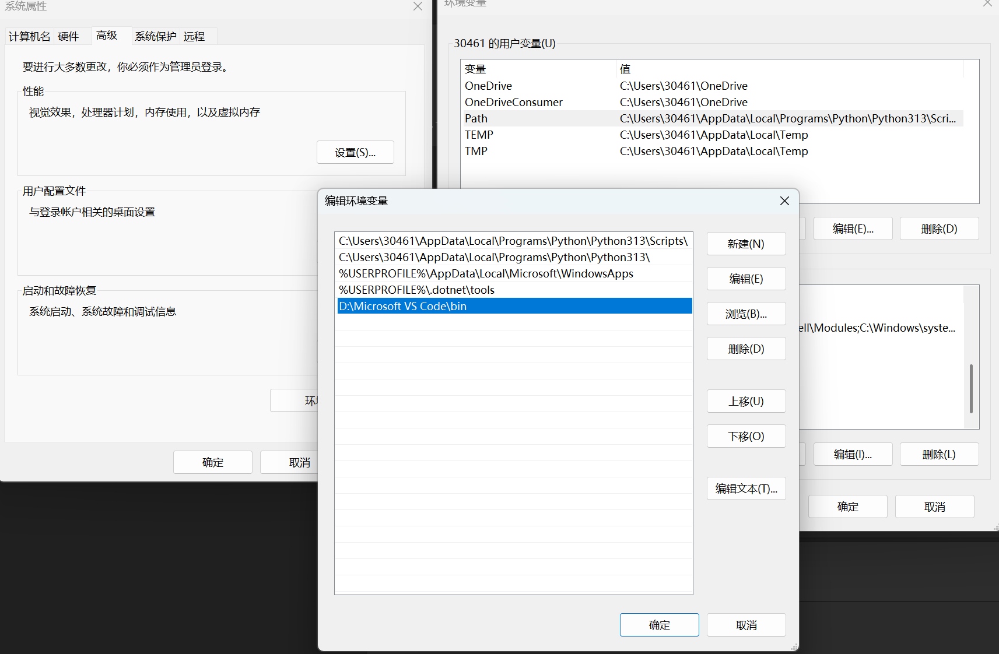

# 前置知识[^2]
## 2.关于环境、虚拟环境、路径等
### （1）环境
***环境*** 通常指的是***环境变量***，可以简单理解为计算机系统中的一个 ***全局设置或备忘录***

***环境变量*** 是一些存储在操作系统中的 ***键值对 [^1]*** 。就像字典一样，一个名字（Key）对应一个值（Value）。它们定义了操作系统或程序运行时所需要的一些基本信息和设置

***环境的主要作用*** 是提供全局配置，让不同的程序都能知道一些关键信息，而无需在每个程序里硬编码这些信息。这使得系统更灵活，配置更统一

关于 ***全局配置*** ：是”大环境”起的作用，其体现为：
1. 作用范围全局：对所有程序生效  
    
>解释：一旦一个环境变量被设置（比如JAVA_HOME=C:\Java），那么从此刻起，任何从命令行启动的程序、脚本，甚至是某些图形界面程序，都能读取到这个变量的值。你不需要在每个需要Java的程序里重新写一遍Java的安装路径。

2.  访问方式全局：提供统一的标准接口
>解释：环境变量为所有程序提供了一个统一、标准化的方式来获取配置信息。

==我的思考==：如果没有全局配置会发生什么？
我去了解到的例子：
>情景：你在命令行输入 python 命令，想运行Python解释器。
>1. 没有全局PATH（局部配置）：
每个想调用python的程序（比如脚本、工具软件），都必须自己写死Python解释器的完整绝对路径:
C:\Users\YourName\AppData\Local\Programs\Python\Python39\python.exe my_script.py
>2. 有全局PATH（全局配置）：
只需一次，将Python的安装路径C:\...\Python39\添加到系统的PATH变量中。
此后，任何一个程序（无论是命令行还是PyCharm，还是任何其他软件）在需要运行python命令时，它都不需要知道python.exe在哪,程序会直接呼叫操作系统：“我要运行python”.操作系统这个“全局管理员”接到请求，立刻去查阅PATH这个“全局通讯录”，按图索骥，找到python.exe并启动它。
***
### （2）路径
***路径*** 是最重要的环境变量

PATH 环境变量里面存储的是一系列目录的地址。当命令行（如CMD、PowerShell、Terminal）中输入一个命令（比如 python 或 notepad）时，操作系统就会按照 PATH 中列出的目录顺序，去这些目录里寻找输入的命令对应的可执行程序文件

至于为什么要安装全局PATH?上面的例子正好也帮我解释了这个问题

我当时在vscode配置c语言过程截图：

系统>>高级系统设置>>环境变量编辑>>Path

***
### （3）虚拟环境
==我刚刚想了的一个自然而然的问题==：***虚拟环境*** 是虚拟的环境变量吗？——不完全是

D老师刚刚以python为例，系统性回答困扰我较久的这个概念——虚拟环境：
***虚拟环境的核心思想：==依赖隔离==***
诞生背景：
>我正在同时开发两个Python项目：
项目A 需要 pandas 库的 1.0 版本。
项目B 需要 pandas 库的 2.0 版本。
Python的默认包管理工具 pip 会把所有第三方库都安装到同一个全局目录下。这意味着我们无法同时安装同一个库的两个不同版本。如果你为项目B安装了 pandas 2.0，它就会覆盖掉项目A所需的 1.0 版本，导致项目A无法运行

一个虚拟环境是一个独立的、自包含的***Python工作空间*** 。它主要虚拟了以下三个东西：
1. 独立的 ***Python包安装目录*** ：
    应该是说我的python不同的第三方插件可以互不干扰的使用
2. 一个“虚拟”的 ***Python解释器*** ：
    欺骗我的系统，认为该环境只有一个可用解释器？可以这么说吧？
3. 一套“被修改”的环境变量(我想主要是path)

我想我在系统性学习python的时候可以再去了解一下python的特性

==我更多的思考==：
1. 为什么我们在讲虚拟环境中主要都讨论python，而C语言、C++等很少依赖虚拟环境？是否与python该语言的某些特性相关呢？
>* 历史遗留问题：Python的全局site-packages设计是历史遗留问题，venv是一个优秀且成功的“补丁”而新语言可以避免这个设计失误
>* Python 的核心问题：全局解释器和站点包（site-packages）
    1. 全局安装的默认行为：Python 在设计上，当你使用 pip install 时，默认会将包安装到全局的 site-packages 目录中。所有项目都会共享这个目录。而另外很多语言存在天然隔离
    2. “依赖地狱”（Dependency Hell）：如果项目A需要Django 3.2，而项目B需要Django 4.2，它们无法在全局环境中共存。版本冲突无法避免。
    3. 虚拟环境作为解决方案：venv（Python 3.3+ 官方标准库）和之前的 virtualenv 就是为了解决这个问题而生的。它们通过创建一个轻量级的“副本”环境，拥有自己的 site-packages 和 pip，完美地将项目依赖隔离开来。
2. 为什么ML更多的用python？
简答：表达效率更高，为ML量身打造了大量库站
***
### ==模仿deep seek总结我的理解==
成小电来到广阔的清水河校区（系统）：
1. 环境变量：校规校训——全体师生共用的规则指引
2. path:新生领航员的名单地图，你说你要kfc,学长一看地图发现学校没有kfc,他像Windows人一样的回复你:
“‘kfc’ is not recognized as an internal or external command...”
3. 虚拟环境：不同的学院需要完成特定的项目——就像医学院的核磁共振仪不能和材料学院的TEM搞混了（都是成电的财产）（完成某些项目的包），就像 ~~妓院~~ 的显卡不给软院用一样

[^1]:键值对：
    * 键值对是一种非常直观的数据组织方式，它由两个相关联的部分组成：
        1. 键：可以看作是唯一标识符、名字或关键词。它用于“查找”
        2. 值：是与键相关联的数据、信息或内容。它是被查找的结果
    * ==我的理解==：就像字典，键 表示检索的字词，值 表示该字词的释义
    * 例子：环境变量的场景下 
        >JAVA_HOME 为键
    	C:\Program Files\Java\jdk-17 为值
    	说明：操作系统用JAVA_HOME这个键，来找到Java安装路径这个值。

[^2]:==本节的思考和解决方法==：
    * 特别感谢D老师的通俗的讲解，这里的一大部分笔记摘录自deepseek
    *  链接模式的学习方法——哪里不会点哪里——辐射式的学习方式挺方便的